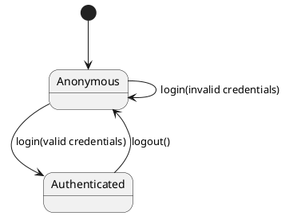
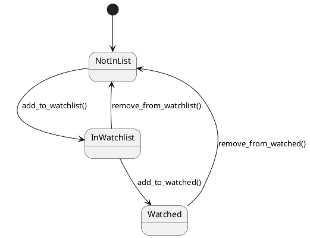

#  Design

This chapter explains the design strategies adopted to satisfy the requirements identified in the analysis. The goal of the design is to define the structure of the system independently from low-level implementation details, while still remaining consistent with the final project.

----------

##  Architecture

###  Architectural style

The system adopts a **layered architecture** with **dependency inversion through ports**, which gives it some characteristics of a lightweight **hexagonal architecture (ports and adapters)**.

At a high level, the system is organized into three main layers:

-   **Presentation layer**
    
-   **Application layer**
    
-   **Infrastructure layer**
    

The presentation layer contains the user interface.  
The application layer contains the use cases and business rules.  
The infrastructure layer contains technical adapters for persistence and external APIs.

### Why this style was chosen

This style was chosen because it supports:

-   clear separation of concerns
    
-   easier testing
    
-   reduced coupling between business logic and technical details
    
-   easier future replacement of infrastructure components
    

A particularly important design choice is that the application service does not depend directly on concrete implementations such as SQLite or OMDb. Instead, it depends on abstract interfaces (`RepoPort` and `MovieInfoPort`). This means that the business logic is defined independently from the actual persistence or movie data provider.

### Why not other styles

-   **Event-based architecture** was not chosen because the system does not require asynchronous communication or event streams.
    
-   **Shared dataspace architecture** was not appropriate because the application does not involve multiple components concurrently writing to a common distributed space.
    
-   **Pure object-based architecture** would not be enough to express the separation between application logic and external technical adapters.
    
-   **Microservice/distributed architecture** would have been unnecessarily complex for the project scope.
    

### Adopted architectural structure

The system follows this structure:

-   **Presentation layer**: Streamlit user interface implemented in `popcorn_meter/ui/streamlit_app.py`
    
-   **Application layer**: `AppService` and application ports defined in `popcorn_meter/application/`
    
-   **Infrastructure layer**:
    
    -   `SqliteRepo`
        
    -   `OmdbClient`
        

The presentation layer is also responsible for assembling the concrete infrastructure components and injecting them into the application service.

### Responsibilities of each architectural component

#### Presentation layer

Responsible for:

-   rendering pages
    
-   collecting user input
    
-   maintaining session state
    
-   calling application use cases
    
-   showing feedback messages and visual elements
    

This responsibility is mainly implemented in:

-   `popcorn_meter/ui/streamlit_app.py`
    

#### Application layer

Responsible for:

-   user registration and login
    
-   watchlist and watched list management
    
-   genre preference management
    
-   feedback handling
    
-   recommendation generation
    
-   orchestration of persistence and movie data retrieval
    

This responsibility is mainly implemented in:

-   `popcorn_meter/application/use_cases.py`
    

#### Infrastructure layer

Responsible for:

-   storing and retrieving persistent data from SQLite
    
-   hashing and verifying passwords
    
-   retrieving movie details from OMDb
    
-   retrieving movie details from OMDb, while trending titles are currently fetched directly in the Streamlit UI
    

This responsibility is mainly implemented in:

-   `popcorn_meter/infrastructure/sqlite_repo.py`
    
-   `popcorn_meter/infrastructure/omdb_client.py`
    

----------

### High-level architecture diagram


----------

##  Infrastructure

Although the application is not a distributed system in the strict sense, it still includes infrastructural components that support persistence, external communication, and execution.

### Infrastructural components

The system includes:

-   **1 client browser**
    
-   **1 Streamlit application runtime**
    
-   **1 local SQLite database**
    
-   **1 external OMDb API**
    
-   **1 optional external TMDb API** for trending titles
    

### Distribution over the network

The system is mostly centralized on a single machine:

-   the browser and the Streamlit application interact through local or hosted web access
    
-   the SQLite database is stored on the same machine as the application
    
-   OMDb and TMDb are external internet services accessed through HTTP requests
    

So, in the local development setup:

-   application server and database are on the same machine
    
-   external APIs are remote services on the internet
    

### How components find each other

-   The UI instantiates local components directly in code.
    
-   OMDb is contacted through the `OmdbClient` adapter, while TMDb trending titles are currently fetched directly by the Streamlit UI.
    
-   No service discovery, load balancer, broker, or DNS-based internal architecture is required.
    

### Deployment diagram


----------

##  Modelling

The project adopts some *DDD-inspired* design choices, but it is *not a full Domain-Driven Design implementation*.

In particular, the system follows DDD-related principles such as:

- separation between presentation, application, and infrastructure concerns
- dependency inversion through abstract ports (RepoPort and MovieInfoPort)
- identification of the main domain concepts independently from technical details

At the same time, the project does not implement a complete DDD model with rich entities, value objects, aggregate roots, factories, and explicit domain events. Most domain concepts are represented in a lighter way through application-service logic, repository methods, and persisted records.

For this reason, the system is more accurately described as *DDD-inspired* rather than strictly *DDD-driven*.

### Conceptual domain areas

The domain can be conceptually organized into the following areas of responsibility.

#### 1. Authentication

Responsible for:

- user registration
- login
- session identity

Main concepts:


- *user identity*
- *SessionUser (session representation of the logged-in user)*

#### 2. Preferences and personalization

Responsible for:

- favorite genres
- watchlist
- watched movies
- user feedback
- recommendation generation

Main concepts:

- favorite genres
- watchlist item
- watched item
- feedback
- recommended movie titles

#### 3. External movie information

Responsible for:

- retrieving metadata from OMDb
- using external movie information to enrich search and recommendation features

Main concepts:

- movie metadata
- external movie information provider

### Domain concepts in the current implementation

The current implementation includes the following domain concepts, although they are not all modeled as explicit rich domain objects.

#### Core concepts

- *User identity*, represented through persisted login data and the SessionUser object returned after login
- *Favorite genres*, stored persistently and used by the recommendation logic
- *Watchlist* and *watched movies*, associated with a user
- *Feedback*, represented through like/dislike and optional rating values
- *Recommendation results*, computed dynamically from user-related data and external movie metadata

#### Repositories

- RepoPort defines the abstract repository contract used by the application layer
- SqliteRepo implements persistence behavior using SQLite and handles password hashing and verification

#### Services

- AppService acts as the main application service and coordinates the use cases
- recommendation rules are implemented inside the application service rather than in a separate domain service

#### Conceptual domain events

The system does not implement explicit domain event objects. However, the following events can be identified conceptually at the business level:

- user registered
- user logged in
- genres updated
- movie added to watchlist
- movie marked as watched
- feedback saved
- recommendation requested


### DDD note

The project does not model the domain through a complete set of rich entities, aggregate roots, value objects, and factories. Instead, the design uses a lighter application-service-centered structure with repository abstractions and clear domain concepts. This choice was considered appropriate for the project scope and is consistent with describing the system as *DDD-inspired* rather than as a strict DDD implementation.

No explicit domain factories were introduced in this project. Object creation across all domain concepts is straightforward: users are created directly by the repository using a username, email, and hashed password; watchlist and watched entries are simple records with no complex assembly logic. Because no multi-step construction, aggregate assembly, or conditional creation logic is required, introducing dedicated factory classes would add structural overhead without any design benefit at this project's scale.
    


----------

##  Object-Oriented Modelling

### Main data types

#### `AppService`

Main responsibilities:

-   expose use cases to the UI
    
-   coordinate repository and movie provider
    
-   implement recommendation logic
    

Main attributes:

-   `repo: RepoPort`
    
-   `omdb: MovieInfoPort`
    

Main methods:

-   `sign_up`
    
-   `login`
    
-   `set_genres`
    
-   `get_genres`
    
-   `add_to_watchlist`
    
-   `remove_from_watchlist`
    
-   `clear_watchlist`
    
-   `list_watchlist`
    
-   `add_to_watched`
    
-   `remove_from_watched`
    
-   `clear_watched`
    
-   `list_watched`
    
-   `fetch_movie_details`
    
-   `save_feedback`
    
-   `get_feedback`
    
-   `recommend_titles`
    

----------

### `RepoPort`

Defines the persistence operations required by the application layer.

Main responsibilities:

-   abstract user persistence
    
-   abstract genre persistence
    
-   abstract watchlist persistence
    
-   abstract watched persistence
    
-   abstract feedback persistence
    

----------

### `MovieInfoPort`

Defines the contract for retrieving movie metadata.

Main method:

-   `search_by_title`
    

----------

### `SqliteRepo`

Concrete implementation of `RepoPort`.

Main responsibilities:

-   create and query SQLite tables
    
-   hash and verify passwords
    
-   persist genres, watchlist, watched items, and feedback
    

----------

### `OmdbClient`

Concrete implementation of `MovieInfoPort`.

Main responsibilities:

-   resolve OMDb API key
    
-   request movie data from OMDb
    
-   validate returned data format
    

----------

### `SessionUser`

A lightweight dataclass returned after a successful login.

Main attributes:

- `username`
- `user_id`

----------

### Relationships between classes

-   `AppService` depends on `RepoPort`
    
-   `AppService` depends on `MovieInfoPort`
    
-   `SqliteRepo` implements `RepoPort`
    
-   `OmdbClient` implements `MovieInfoPort`
    
-   `SessionUser` is returned by `AppService.login`
    

### UML class diagram


----------

##  Interaction

The main interaction style is **request-response**.

The UI sends user requests to the application service.  
The application service delegates persistence operations to the repository and external movie retrieval to the OMDb adapter.

### Typical interaction patterns

-   UI → AppService → RepoPort → database
    
-   UI → AppService → MovieInfoPort → OMDb API
    
-   UI → TMDb API (for trending titles only)
    

### Sequence diagram: fetch movie details


### Sequence diagram: add movie to watchlist


----------

##  Behaviour

### Stateful components

The following components are stateful:

-   **SQLite database**
    
-   **Streamlit session state**
    
-   persisted user feedback, genres, watchlist, and watched data
    

The session state stores temporary runtime information such as:

-   current logged-in user
    
-   current page
    
-   last opened or searched movie details
    
-   dismissed recommendations

-   recommendation page state

-   current home search query
    

### Stateless components

The following components are mostly stateless:

-   `AppService`
    
-   `OmdbClient`
    

Although `AppService` coordinates state changes, it does not keep persistent internal state by itself.

### Components responsible for updating state

-   **`SqliteRepo`** updates persistent state when:
    
    -   a user is created
        
    -   genres are updated
        
    -   watchlist changes
        
    -   watched list changes
        
    -   feedback is saved
        
-   **Streamlit UI** updates session state when:
    
    -   login/logout occurs
        
    -   page changes
        
    -   temporary UI selections are made
        

### Activity-like behavior for recommendations

Recommendation generation behaves as follows:

1.  retrieve genres
    
2.  retrieve watched movies
    
3.  retrieve watchlist
    
4.  retrieve feedback
    
5.  fetch OMDb data for candidate movies
    
6.  compute scores
    
7.  sort results
    
8.  if no OMDb-based results exist, fall back to a built-in demo catalog
    

This behavior is deterministic and request-driven.

### State diagram: User Session

The following state diagram describes the lifecycle of a user session.



### State diagram: Watchlist Item Lifecycle

The following state diagram describes the lifecycle of a movie item relative to a user's lists.



----------

##  Data-related aspects

### Data-flow diagram: Recommendation pipeline

The following diagram shows how data flows through the system when generating recommendations.

```
[User Profile Data] ──► AppService ──► [OMDb API]
                            │                │
                            ▼                ▼
                     [Hybrid Scorer] ◄── [Movie Metadata]
                            │
                            ▼
                     [Ranked Results] ──► [UI]
```

User genre preferences and watched history are retrieved from SQLite via `SqliteRepo`, passed to `AppService`, which queries `OmdbClient` for movie metadata. The hybrid scorer combines both inputs to produce a ranked list returned to the Streamlit UI.

----------

### Persistent data

The system stores persistent user-related data in a **relational SQLite database**.

Stored data includes:

-   users
    
-   favorite genres
    
-   watchlist entries
    
-   watched movie entries
    
-   feedback entries
    

### Why relational storage was chosen

Relational storage was chosen because:

-   the data is structured
    
-   stored records are clearly associated with users
    
-   uniqueness and integrity constraints are needed
    
-   the project scope does not require a distributed or document-oriented database
    

### Where data is stored

Persistent data is stored in a local file-based SQLite database:

-   default path in the repository adapter points to `data/popcorn_meter.db`
    
-   in the current UI composition, the application is instantiated with `popcorn_meter.db`
    

### Which components query the database

Only `SqliteRepo` performs direct database queries.

This is important architecturally, because it preserves the boundary between business logic and persistence.

### Types of queries performed

The repository performs:

-   inserts for new users and list entries
    
-   selects for login verification and retrieval
    
-   deletes for removal and clearing operations
    
-   upserts for feedback persistence
    

### Concurrent access

The system is designed primarily for a single-user or low-concurrency academic setting.

-   concurrent reads are possible in practice through SQLite
    
-   concurrent writes are limited by SQLite’s locking model
    
-   this is acceptable for the intended project scope
    

### Shared data between components

The following data is shared conceptually across layers:

-   user identity (`SessionUser`)
    
-   movie titles
    
-   recommendation results
    
-   feedback values
    
-   movie details retrieved from OMDb
    

The application layer acts as the central coordination point for this shared data.


    
